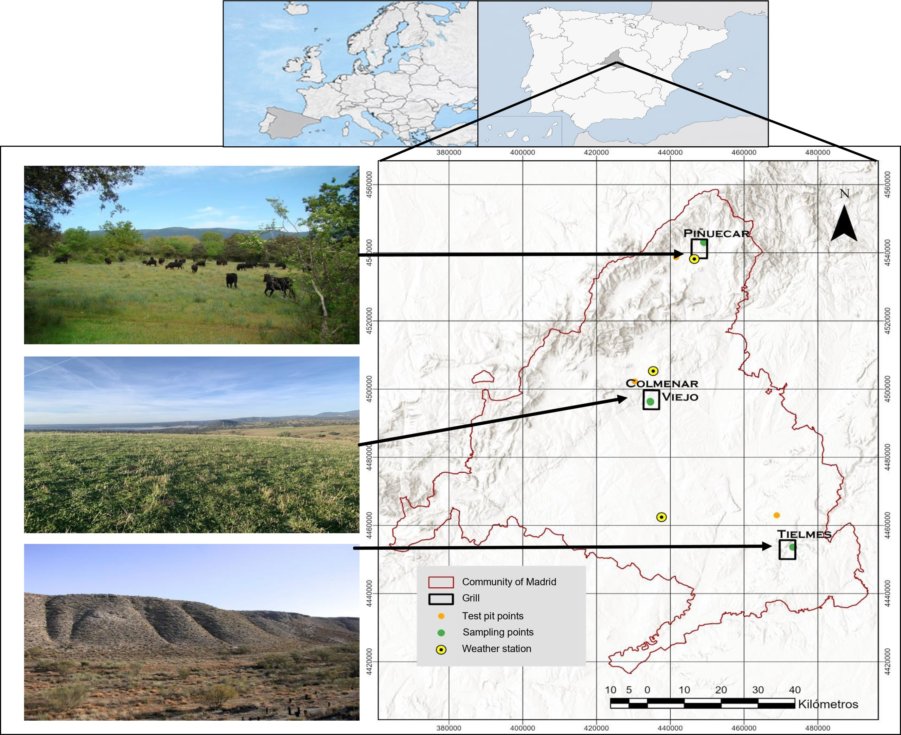
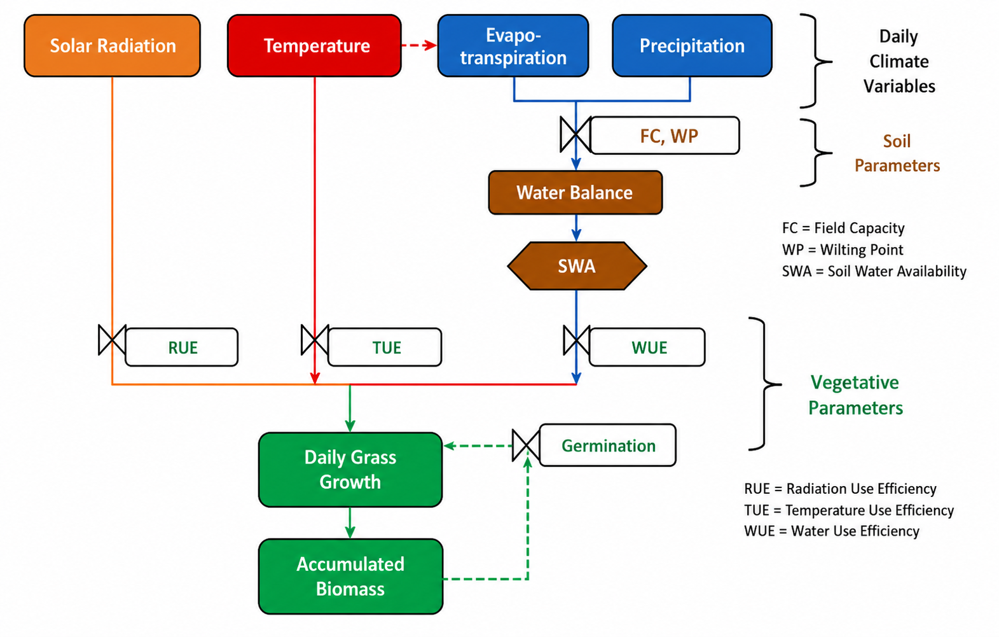
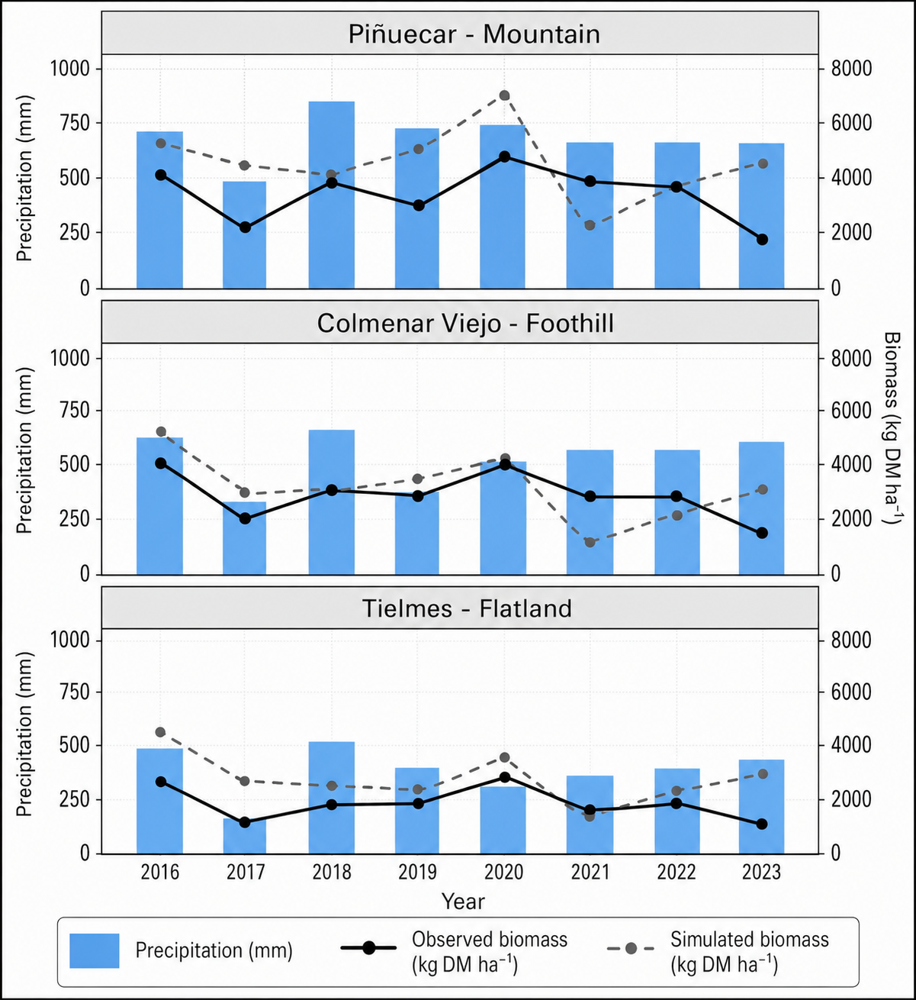
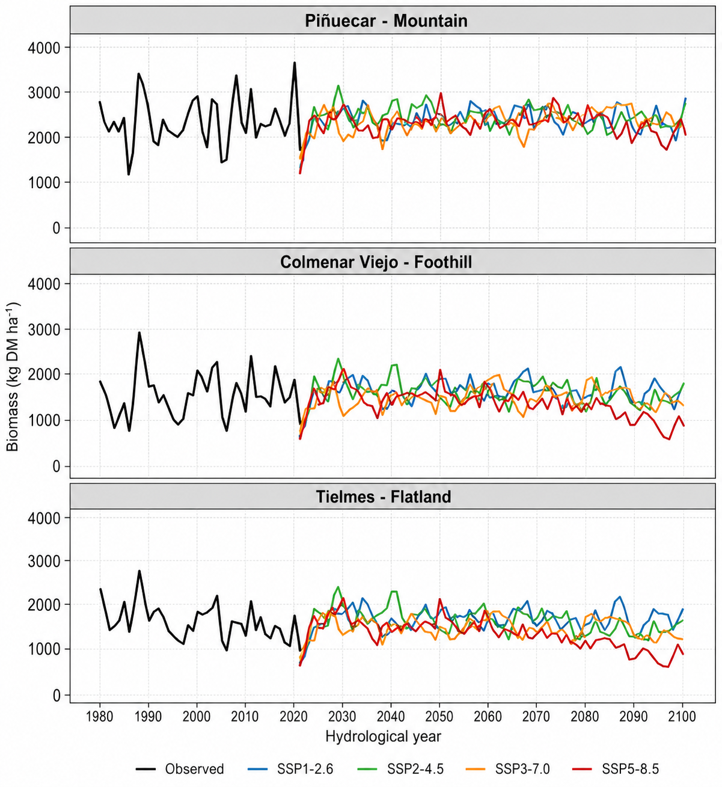

# Mediterranean Grassland Productivity under Climate Change

Ecohydrological modelling of Mediterranean grassland biomass production under
historical and future climate conditions in Central Spain.

## Overview

This repository presents a cleaned, portfolio-oriented version of the analytical
workflow used to investigate climate-change impacts on Mediterranean grassland
productivity across a hydroclimatic gradient.

The study combines field observations, meteorological data, soil properties and
vegetation parameters with the SIMPAST ecohydrological model. The model was
calibrated with 2016–2023 productivity observations, independently evaluated
with 2024–2025 biomass observations, and then applied to CMIP6 climate
projections.

## Study area



Three Mediterranean grassland systems in Central Spain represent contrasting
hydroclimatic environments:

- **Piñuecar** — mountain grassland
- **Colmenar Viejo** — foothill grassland
- **Tielmes** — semi-arid flatland

## Modelling framework



The workflow links daily climate variables to soil-water availability and
vegetation growth. Biomass production is constrained by water, radiation and
temperature conditions.

## Model performance



Calibration achieved R² values of approximately 0.90–0.91 across the three
grassland systems. Independent 2024–2025 validation produced RMSE values of
673, 506 and 771 kg DM ha⁻¹ for the mountain, foothill and flatland systems,
respectively.

## Climate-change projections



The model was driven by an ensemble of six CMIP6 global climate models under
four Shared Socioeconomic Pathways:

- SSP1-2.6
- SSP2-4.5
- SSP3-7.0
- SSP5-8.5

Under SSP5-8.5, projected productivity reductions by the end of the century are
approximately 4% for the mountain system, 25% for the foothill system and 33%
for the semi-arid flatland system, with increasing interannual variability
toward drier environments.

## Repository structure

```text
.
├── README.md
├── CITATION.cff
├── data/
│   └── README.md
├── figures/
│   ├── README.md
│   ├── study_area.png
│   ├── model_framework.png
│   ├── observed_vs_simulated_biomass.png
│   └── future_biomass_projections.png
└── src/
    ├── 01_climate_data_processing.R
    ├── 02_ecohydrological_model.R
    ├── 03_parameter_calibration.R
    ├── 04_model_evaluation.R
    └── 05_results_visualization.R
```

## Code workflow

```text
Climate data
    ↓
Climate-data processing
    ↓
Soil water balance (SWC / SWA)
    ↓
Environmental growth limitations
    ↓
Daily biomass simulation
    ↓
Parameter calibration
    ↓
Independent model evaluation
    ↓
CMIP6 climate-change analysis
```

## Reproducibility note

This repository is a cleaned public portfolio implementation derived from the
research workflow. Local paths, intermediate Excel files and raw/project data
are intentionally excluded. The repository therefore demonstrates the modelling
architecture and analytical methods, but it is not yet a one-command
reproduction package.

## Publication

Berzal Martínez, A., Sanz, E., Díaz-Ambrona, C. G. H., Almeida-Ñauñay, A. F.,
& Tarquis, A. M. (2026). *Climate Change Impacts on Mediterranean Grassland
Productivity Along a Climatic Gradient in Central Spain: An Ecohydrological
Modeling Approach*. **Agronomy, 16**, 1340.

**DOI:** 10.3390/agronomy16141340

The associated article is published under the Creative Commons Attribution
(CC BY) license.

## Skills demonstrated

**R · Environmental modelling · Ecohydrology · Climate-data processing · CMIP6 ·
Model calibration · Independent validation · Scientific visualization ·
Climate-change impact assessment**
